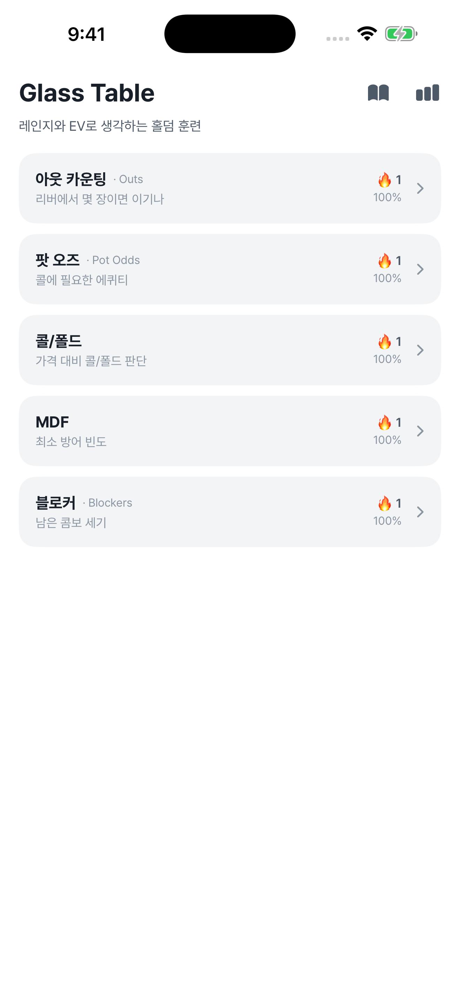
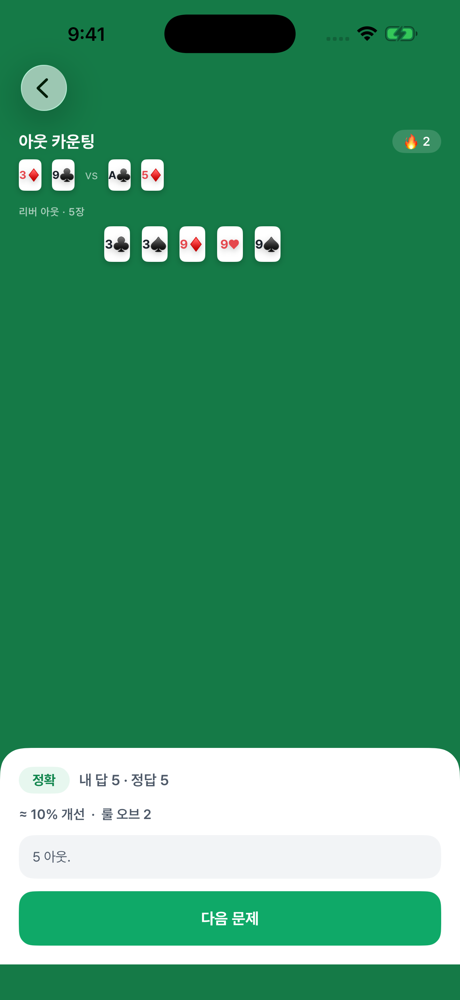
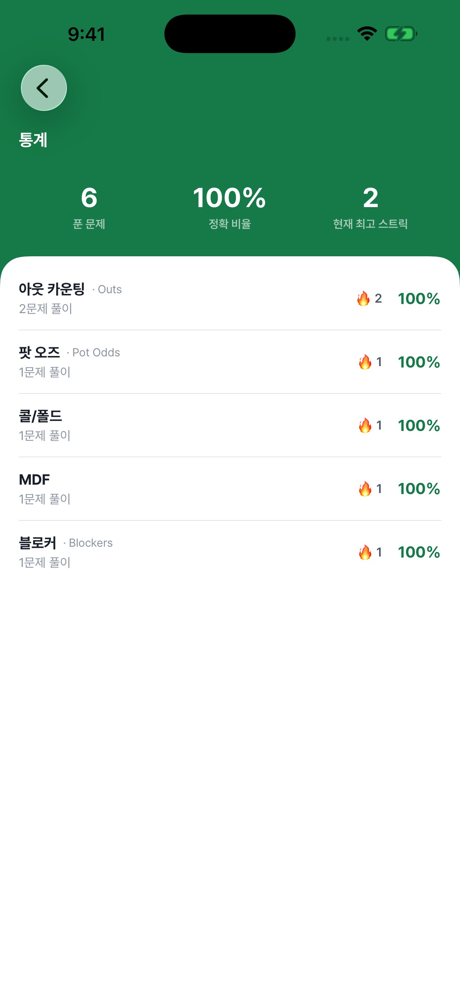

# Glass Table

**레인지와 EV로 생각하는 홀덤 훈련** — a Korean-first iOS trainer for No-Limit
Hold'em math. Free, fully offline, no ads, no accounts.

[](https://github.com/mhju0/glass-table/actions/workflows/ci.yml)
[](https://github.com/mhju0/glass-table/actions/workflows/engine-gate.yml)
[](LICENSE)


Glass Table teaches serious-minded amateurs to think about poker in **ranges
and EV** instead of hunches. Every spot runs the same loop: **decide → reveal →
grade** — commit to your answer first, then see the exact numbers, then get
graded 정확/근접/빗나감 so your estimates calibrate over time.

| Home | Drill | Stats |
|---|---|---|
|  |  |  |

## The five drills

1. **아웃 카운팅 · Outs** — count the winning cards, estimate equity with the rule of 2/4
2. **팟 오즈 · Pot Odds** — convert a call price into required equity (%)
3. **콜/폴드** — compare estimated vs. required equity and decide
4. **MDF** — minimum defense frequency for a bet size
5. **블로커 · Blockers** — how card removal changes combo counts

Streaks and accuracy are stored on-device only — the app has zero networking.
See the [privacy policy](https://mhju0.github.io/glass-table/privacy-policy.html).

## Architecture

```
GlassTableEngine   pure poker math (equity, grading) — correctness-proven, release-mode test gate
      ↑
GlassTableDrills   drill logic: spot generators, sessions, progress — plain Swift, fast tests
      ↑
GlassTable         thin SwiftUI app (screens + design system)
```

The heavy lifting lives in two Swift packages so nearly everything is testable
without a simulator. Design docs live in [`docs/`](docs/), including the product
brief, decisions log, and per-feature specs/plans.

## Building

The Xcode project is generated by [XcodeGen](https://github.com/yonaskolb/XcodeGen)
and not committed:

```sh
xcodegen generate
xcodebuild -project GlassTable.xcodeproj -scheme GlassTable \
  -destination 'platform=iOS Simulator,name=iPhone 17' \
  CODE_SIGNING_ALLOWED=NO build
```

## Testing

```sh
swift test --package-path GlassTableDrills          # app logic — fast
swift test -c release --package-path GlassTableEngine   # math gate — release config, slower
```

## License

[MIT](LICENSE) © 2026 Michael Ju
