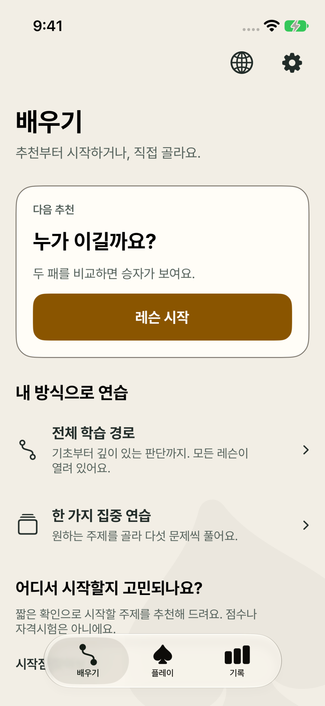
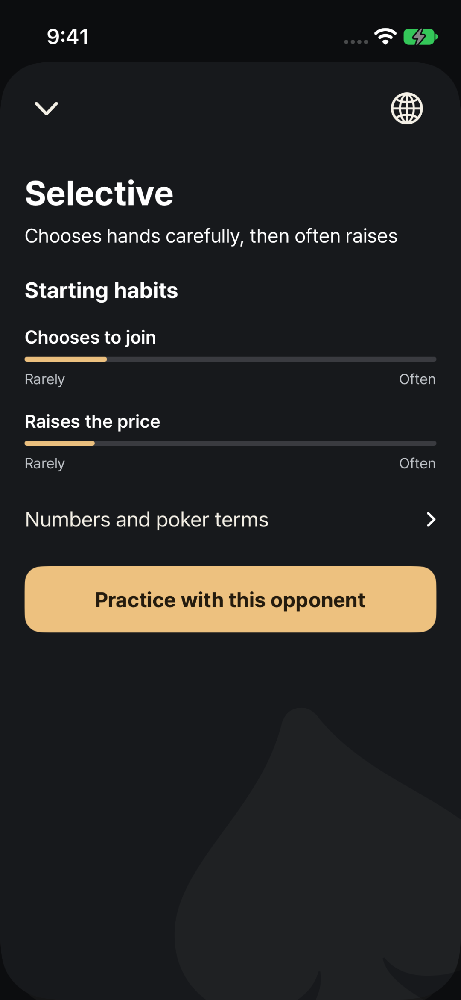
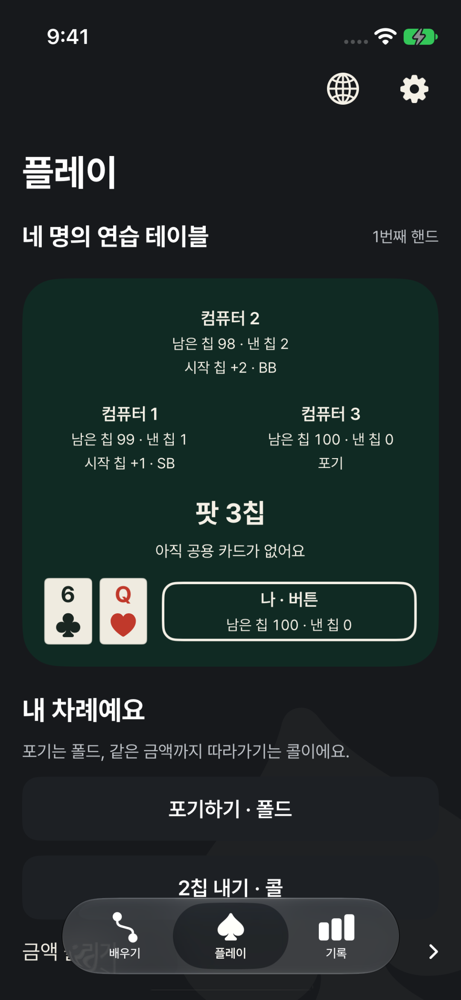

# Glass Table

**기초부터 레인지와 EV까지, 직접 판단하며 배우는 홀덤**

Glass Table is an offline iPhone learning app for No-Limit Hold'em, in Korean
and English. It combines a recommended learning path, freely available practice,
and a four-player computer table. Start with reading cards; build toward ranges,
probability, and the cost of a decision.

[](https://github.com/mhju0/glass-table/actions/workflows/ci.yml)
[](https://github.com/mhju0/glass-table/actions/workflows/engine-gate.yml)


> Status: active user testing. The app has not been released on the App Store.

| Follow a recommendation—or choose | Understand your opponent |
|---|---|
|  |  |
| Nine units and 18 concepts stay open; an optional starting-point check suggests where to begin. | Everyday names lead; numbers and technical terms are optional detail. |

| Practice a complete hand | Explore the chart |
|---|---|
|  |  |
| Four seats, local computer opponents, and a factual review of the chips and cards. | A compact hand summary leaves room for the chart and its enlarged explorer. |

## Product

Learn combines brief introductions, worked examples, five-question practice,
delayed review, and mixed checkpoints. It recommends a next activity without
locking advanced lessons. The optional, untimed starting-point check changes
the recommendation—not completed lessons or earned mastery.

Play offers four-player hands with 100 starting chips, carried stacks, and
explicit refills when a player runs out. Its review reports what happened; it
does not pretend to calculate a strategy grade. A separate heads-up exercise
grades preflop choices against a published chart and postflop choices under a
disclosed checkdown approximation—not universal poker advice.

Progress separates exact answers, near answers, and mistakes. Comparable
practice history and optional response times show change without rewarding
speed over accuracy. Recent table habits appear only after enough evidence;
they describe these practice hands, not personality or professional ability.

Glass Table is fully offline. It has no accounts, analytics, ads, purchases, or
real-money wagering. Progress stays on device and can be exported or imported
through Files. Saved sessions resume across relaunches. Atomic writes, visible
save failures, validation, and preserved migration/recovery bytes protect the
local record. Language and appearance can be changed inside the app.

## Engineering

```text
GlassTable        native SwiftUI screens and design system
      ↓
GlassTableDrills  pure Swift generators, grading, curriculum, review, persistence
      ↓
GlassTableEngine  pure Swift evaluator, equity, ranges, and board texture
```

The UI is a thin client over two Swift packages that do not import UIKit or
SwiftUI. Seeded generators keep a question, its grade, and its explanation on
the same deterministic spot. The archetype policy and surviving range are data
the learner can inspect inside the app instead of an undisclosed bot decision.

Verification is split by boundary: package tests cover poker math and drill
logic, XCTest exercises real navigation and input, and `tools/uisweep.sh`
captures normal and Accessibility XXXL layouts on a disposable simulator. A
screenshot is visual evidence only; interaction tests separately cover scrolling
and reachable controls.

The combined release is installed for testing on an iPhone 12 mini. Automated
checks and migration readback are recorded in the [delivery report](docs/specs/2026-09-23-beginner-native-release.md);
physical VoiceOver, novice comprehension, minimum-OS and distribution checks
remain separate release gates.

## Build and test

Requires macOS, Xcode 26 or newer, and
[XcodeGen](https://github.com/yonaskolb/XcodeGen). The deployment target is iOS
17. The generated Xcode project is intentionally not committed.

```sh
brew install xcodegen
xcodegen generate
xcodebuild -project GlassTable.xcodeproj -scheme GlassTable \
  -destination 'generic/platform=iOS Simulator' CODE_SIGNING_ALLOWED=NO build

swift test --package-path GlassTableDrills
swift test -c release --package-path GlassTableEngine
xcodebuild -project GlassTable.xcodeproj -scheme GlassTable \
  -destination 'platform=iOS Simulator,name=iPhone 17' \
  CODE_SIGNING_ALLOWED=NO test
```

The engine gate runs in Release because its exhaustive checks are impractically
slow in Debug. Use `tools/uisweep.sh --list` to inspect the available visual
fixtures, or run the full normal and accessibility sweep with
`tools/uisweep.sh`.

## Project notes

- [Design direction](DESIGN.md)
- [Research foundation](docs/specs/2026-09-13-revamp-research.md)
- [Combined beginner release and verification](docs/specs/2026-09-23-beginner-native-release.md)
- [Learner-trust audit and verification limits](docs/specs/2026-09-20-learner-trust-audit.md)
- [App Store preparation status](docs/submission.md)
- [Privacy policy](docs/privacy-policy.md)
- [License](#license)

## License

Copyright (c) 2026 Michael Ju. All rights reserved.

No license is granted for use, copying, modification, or distribution of this
code as of 2026-07-30. This repository is public for portfolio review purposes
only.
