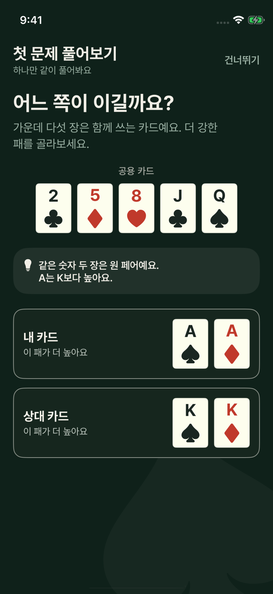
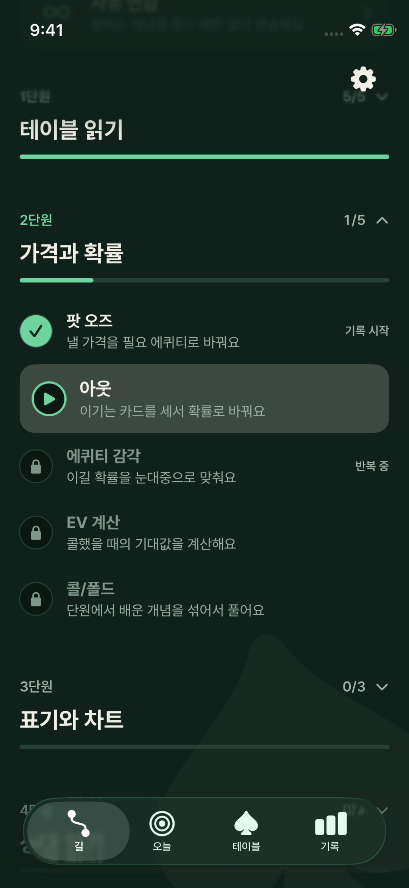
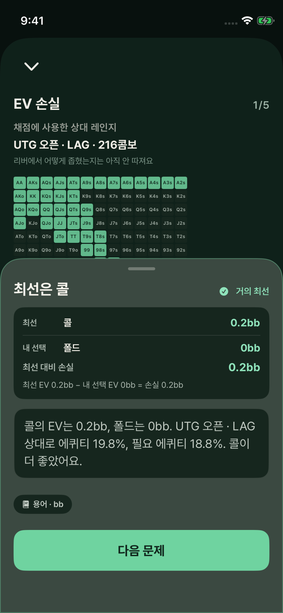
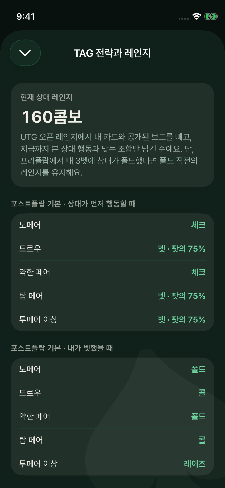

# Glass Table

**레인지와 EV로 생각하는 홀덤 훈련**

Glass Table is a Korean-first iPhone app for learning No-Limit Hold'em through
ranges, equity, and expected value. A learner commits to a decision before the
app reveals the benchmark, the calculation, and the reason behind the grade.

[](https://github.com/mhju0/glass-table/actions/workflows/ci.yml)
[](https://github.com/mhju0/glass-table/actions/workflows/engine-gate.yml)


> Status: active user testing. The app has not been released on the App Store.

| Start with a real decision | Follow the course |
|---|---|
|  |  |
| Compare complete hands before the product introduction. | Nine units move from reading the table to range and EV decisions. |

| Inspect the cost of a choice | Inspect the opponent model |
|---|---|
|  |  |
| Feedback shows the best EV, chosen EV, subtraction, and range used for grading. | The table publishes each archetype's policy and the limits of its range estimate. |

## Product

The course combines worked examples, independent retrieval, explanatory
feedback, delayed review, and mixed checkpoints. Daily study recommends either
a due review or the next lesson. Free practice keeps every drill available
without changing course gates.

The table mode plays a heads-up hand against one of five rule-based archetypes.
Preflop choices use the published defend chart. Postflop choices are priced in
big blinds under the approximation disclosed in the reveal. The app presents
these results as conditional training feedback, not universal poker advice.

Glass Table is fully offline. It has no accounts, analytics, ads, purchases, or
real-money wagering. Progress stays on device and can be exported or imported
through Files. Atomic writes, explicit unreadable-file recovery, and preserved
recovery bytes protect the local record.

## Engineering

```text
GlassTable        native SwiftUI screens and design system
      ↓
GlassTableDrills  pure Swift generators, grading, curriculum, review, persistence
      ↓
GlassTableEngine  pure Swift evaluator, equity, ranges, and board texture
```

The UI is a thin client over two Swift packages that do not import UIKit or
SwiftUI. Seeded generators keep a question, its grade, and its explanation on
the same deterministic spot. The archetype policy and surviving range are data
the learner can inspect inside the app instead of an undisclosed bot decision.

Verification is split by boundary: package tests cover poker math and drill
logic, XCTest exercises real navigation and input, and `tools/uisweep.sh`
captures normal and Accessibility XXXL layouts on a disposable simulator. A
screenshot is visual evidence only; interaction tests separately cover scrolling
and reachable controls.

## Build and test

Requires macOS, Xcode 26 or newer, and
[XcodeGen](https://github.com/yonaskolb/XcodeGen). The deployment target is iOS
17. The generated Xcode project is intentionally not committed.

```sh
brew install xcodegen
xcodegen generate
xcodebuild -project GlassTable.xcodeproj -scheme GlassTable \
  -destination 'generic/platform=iOS Simulator' CODE_SIGNING_ALLOWED=NO build

swift test --package-path GlassTableDrills
swift test -c release --package-path GlassTableEngine
xcodebuild -project GlassTable.xcodeproj -scheme GlassTable \
  -destination 'platform=iOS Simulator,name=iPhone 17' \
  CODE_SIGNING_ALLOWED=NO test
```

The engine gate runs in Release because its exhaustive checks are impractically
slow in Debug. Use `tools/uisweep.sh --list` to inspect the available visual
fixtures, or run the full normal and accessibility sweep with
`tools/uisweep.sh`.

## Project notes

- [Design direction](DESIGN.md)
- [Research foundation](docs/specs/2026-09-13-revamp-research.md)
- [Learner-trust audit and verification limits](docs/specs/2026-09-20-learner-trust-audit.md)
- [App Store preparation status](docs/submission.md)
- [Privacy policy](docs/privacy-policy.md)
- [License](#license)

## License

Copyright (c) 2026 Michael Ju. All rights reserved.

No license is granted for use, copying, modification, or distribution of this
code as of 2026-07-30. This repository is public for portfolio review purposes
only.
