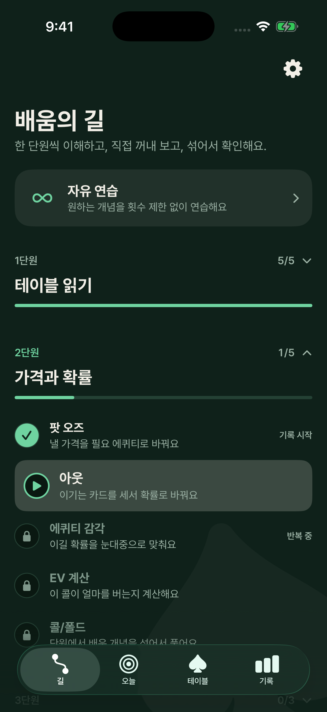
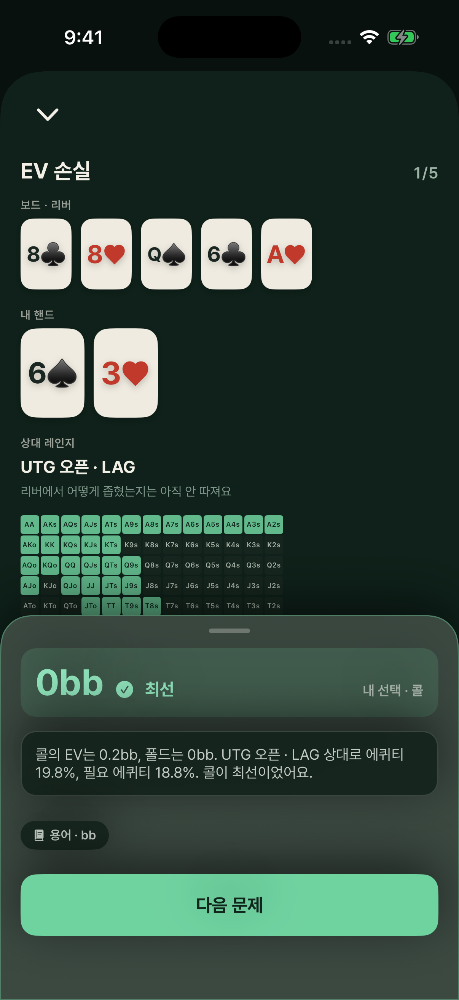
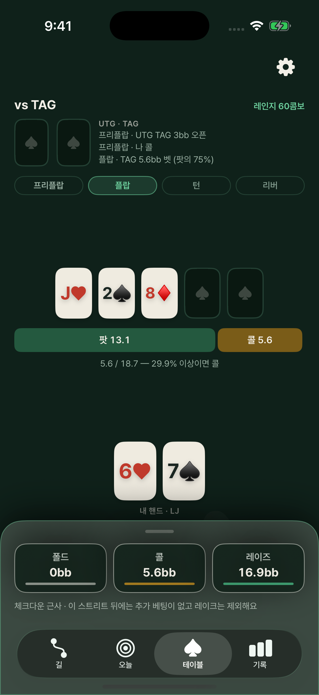
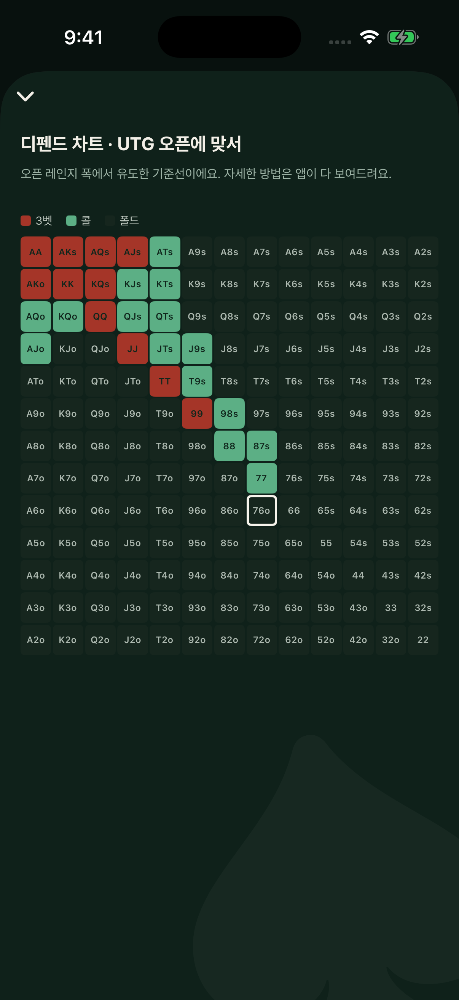

# Glass Table

**레인지와 EV로 생각하는 홀덤 훈련** — a Korean-first iOS trainer for No-Limit
Hold'em. Free, fully offline, no ads, no accounts.

[](https://github.com/mhju0/glass-table/actions/workflows/ci.yml)
[](https://github.com/mhju0/glass-table/actions/workflows/engine-gate.yml)


Glass Table teaches serious-minded amateurs to think about poker in **ranges
and EV** instead of hunches. Every spot runs the same loop: **decide → reveal →
grade** — commit to your answer first, then see the exact numbers and where they
came from. The opponents are rule-based archetypes whose strategies are
**published inside the app**, so every grade is computable and checkable rather
than handed down by a black box.

| 길 — the course | Decide → reveal | 테이블 — a graded hand | The chart, derived |
|---|---|---|---|
|  |  |  |  |

## What's inside

- **길** — a linear course of 8 units / 18 concepts, from reading a showdown to
  defending against an open: pot odds, outs, equity sense, EV, combos, range
  notation, RFI charts, range reads, board texture, hit frequency, range
  advantage, EV-loss decisions, action reads, and the defend chart. Every new
  concept opens with a step-by-step worked example (천천히); mastery and review
  run on FSRS spaced repetition.
- **테이블** — play a heads-up hand against a chosen archetype (Nit / TAG / LAG /
  콜링 스테이션 / 매니악). The bot's pre- and postflop strategy is a printable
  table, its live range narrows on screen as it acts, and every decision comes
  back priced in big blinds — with the hand summary showing *net result* and
  *EV burned* side by side.
- **Calibration** — estimation drills collect a point estimate plus a 90%
  interval, scored by a proper scoring rule (Winkler), so the app can tell you
  whether you're overconfident — not just whether you're right.
- **자유 연습** — every drill, unlimited, no gates.

Progress is stored on-device only — the app has zero networking.
See the [privacy policy](https://mhju0.github.io/glass-table/privacy-policy.html).

## Architecture

```
GlassTableEngine   pure poker math (evaluator, equity, ranges, board texture)
      ↑            — correctness-proven, release-mode test gate
GlassTableDrills   spot generators, grading, archetype policies, the table hand
      ↑            machine, curriculum & spaced repetition — plain Swift, fast tests
GlassTable         thin SwiftUI app (screens + design system)
```

The heavy lifting lives in two Swift packages so nearly everything is testable
without a simulator. Zero third-party dependencies. Design docs live in
[`docs/`](docs/): the product brief, the decisions log (`docs/decisions.md`),
and one spec per shipped slice under [`docs/specs/`](docs/specs/).

## Building

The Xcode project is generated by [XcodeGen](https://github.com/yonaskolb/XcodeGen)
and not committed:

```sh
xcodegen generate
xcodebuild -project GlassTable.xcodeproj -scheme GlassTable \
  -destination 'platform=iOS Simulator,name=iPhone 17' \
  CODE_SIGNING_ALLOWED=NO build
```

`tools/uisweep.sh` screenshots every significant screen via launch-argument
hooks — the cheap way to *look at* the app after a UI change.

## Testing

```sh
swift test --package-path GlassTableDrills          # app logic — fast
swift test -c release --package-path GlassTableEngine   # math gate — release config, slower
```

## License

Copyright (c) 2026 Michael Ju. All rights reserved.
No license is granted for use, copying, modification, or distribution of this code as of 2026-07-30. This repository is public for portfolio review purposes only.
